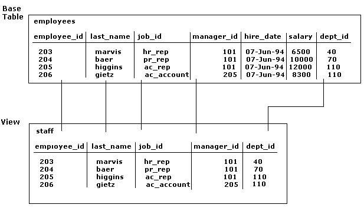
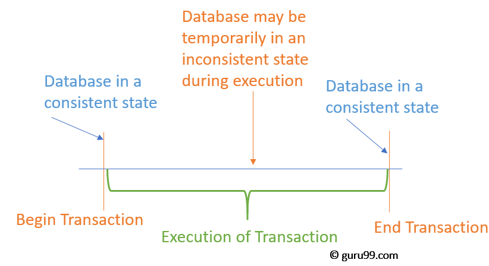
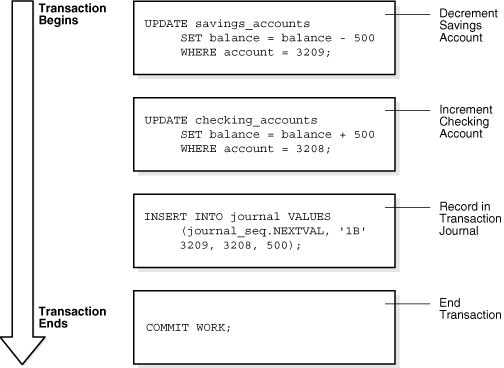

[Introduction](#Introduction) 
1. [Privileges](#privileges)  
2. [Views](#views)  
3. [Users](#users)  
4. [Roles](#roles)  
4.1. [Creating a role](#creating-a-role)   
4.2. [Choosing between different roles](#choosing-between-different-roles)  
4.3. [Roles and Views](#roles-and-views)  
5. [Transactions](#transactions)  
5.1. [Transaction Example](#sample-transaction-account-debit-and-credit)  
5.2. [ACID Compliance](#acid-compliance)  
5.3. [MariaDB vs ORACLE](#mariadb-vs-oracle)  


# Introduction

 > An \<authorization identifier> identifies a set of privileges. An \<authorization identifier> can be either a \<user identifier> or a \<role name>. A \<user identifier> represent a user of the database system. The mapping of \<user identifier>s to operating system users is implementation-dependent. A <role name> represents a role.
 >
 > *The SQL standard*  

# PRIVILEGES

A privilege authorizes a given category of *action* to be performed on a specified base table, view, column, domain, character set, collation, translation, user-defined type, trigger, or SQL-invoked routine by a specified *authorization identifier*.

In other words a privilege is a right to execute a particular type of SQL statement or to access another user's object. Some examples of privileges include the right to:

* Connect to the database (create a session)
* Create a table
* Select rows from another user's table
* Execute another user's stored procedure

Technically, each privilege is represented by a privilege descriptor. A privilege descriptor contains:
* The identification of the base table, view, column, domain, character set, collation, translation, user-defined type, table/method pair, trigger, or SQL-invoked routine module that the descriptor describes.
* The <authorization identifier> of the grantor of the privilege.
* The <authorization identifier> of the grantee of the privilege.
* Identification of the <action> that the privilege allows.
* An indication of whether or not the privilege is grantable.
* An indication of whether or not the privilege has the WITH HIERARCHY OPTION specified.  

The <action>s that can be specified are:  
```
  INSERT  
  INSERT (<column name list>)  
  UPDATE  
  UPDATE (<column name list>)  
  DELETE  
```

To sum up, you grant privileges to users so these users can accomplish tasks required for their jobs. You should grant a privilege only to a user who requires that privilege to accomplish the necessary work. 

DBA must be cautious because excessive granting of unnecessary privileges can compromise security.

A user can receive a privilege in two different ways:

1. You can grant privileges **to users explicitly**. For example, you can explicitly grant to user SCOTT the privilege to insert records into the employees table.

2. You can also grant privileges **to a role** (a named group of privileges), and then grant the role to one or more users. For example, you can grant the privileges to select, insert, update, and delete records from the employees table to the role named clerk, which in turn you can grant to users scott and brian.

Because roles allow for easier and better management of privileges, you should normally grant privileges to roles and not to specific users.

## Privilege levels  

Privileges can be set globally, for **an entire database**, for **a table or routine**, or for individual **columns** in a table. Certain privileges can only be set at certain levels.

**Global privileges** include privileges to administer the database and manage user accounts, as well as privileges for all tables, functions, and procedures.   
**Database privileges** include privileges to create tables and functions, as well as privileges for all tables, functions, and procedures in the database.  
**Table privileges** include the ability to select and change data in the table. Certain table privileges can be granted for individual columns.  
**Column privileges** priv_type are granted by specifying a table for priv_level and providing a column list after the privilege type. They allow you to control exactly which columns in a table users can select and change.  
**Function privilege** specify a function in the default database.  
**Procedure privileges** specify a procedure in the default database.  

# VIEWS

A view is a presentation of data selected from one or more tables (possibly including other views). In addition to showing the selected data, a view also shows the structure of the underlying tables, and can be thought of as the result of a stored query.

The view contains no actual data but rather derives what it shows from the tables and views on which it is based. A view can be queried, and the data it represents can be changed. Data in a view can be updated or deleted, and new data inserted. These operations directly alter the tables on which the view is based and are subject to the integrity constraints and triggers of the base tables.

For example, a base table of all employee data may have several columns and numerous rows of information. If you want a certain set of users to see only specific columns, then you can create a view of that table, containing only the allowable columns. You can then grant other users access to the new view, while disallowing access to the base table.

The following figure shows an example of a view called staff derived from the base table employees. Notice that the view shows only five of the columns in the base table.  



# USERS
> A user is a database level security principal. 

Logins must be mapped to a database user to connect to a database. A login can be mapped to different databases as different users but can only be mapped as one user in each database.

*MariaDB* authorizes access and check permissions on accounts, rather than users. Even if *MariaDB* supports standard SQL commands like CREATE USER and DROP USER, it is important to remember that it actually works with accounts.

An account is specified in the format *'user'@'host'*. The quotes are optional and allow one to include special characters, like dots. The host part can actually be a pattern, which follows the same syntax used in **LIKE** comparisons. Patterns are often convenient because they can match several hostnames.

Omitting the host part indicates an account that can access from any host. So the following statements are equivalent:
```
CREATE USER viviana;
CREATE USER viviana@'%';
```


# ROLES <a name="roles"></a>
> A role, identified by a *role name*, is a set of privileges defined by the union of the privileges defined by the privilege descriptors whose grantee is that *role name* and the sets of privileges of the *role name*s defined by the role authorization descriptors whose grantee is the first *role name*.  
A role may be granted to *authorization identifie*s with a *grant role statement*. No cycles of role grants are allowed.

Roles allow DBAs to manage the multiple permission options easily in complex enviroments. A role is a collection of privileges together that can be assigned to a determined user in just one step. It also simplifies the process of revocation or modification privilege for groups of users. 

Because roles may be granted to other roles, a role is said to "contain" other roles. The set of roles X contained in any role A is defined as the set of roles identified by role authorization descriptors whose grantee is A, together with all other roles contained by roles in X.

### Creating a role 
The command that generate a role is **CREATE ROLE**. It assign the privilege to that role with a GRANT statement, and then assign the privilege to the user to be able to use this role. You can also set a default role, so the user will take it when connecting.

### Choosing between different roles
As a database user, you must set the role when you access the database (if there is not a default role), and you can change the role if needed with a **SET ROLE** statement.

In order to know which role you are, **CURRENT_ROLE** function returns the currently set role for the session, if any.

From the application side, you should be able to set the role (or use the default) before querying to make this work, so in old applications, it could be complex to implement.

### Roles and Views 

When a user sets a role, he, in a sense, has two identities with two associated sets of privileges. But a view (or a stored routine) can have only one definer. So, when a view (or a stored routine) is created with the **SQL SECURITY DEFINER**, one can specify whether the definer should be **CURRENT_USER** (and the view will have none of the privileges of the user's role) or **CURRENT_ROLE** (in this case, the view will use role's privileges, but none of the user's privileges). As a result, sometimes one can create a view that is impossible to use.

# TRANSACTIONS
> An SQL-transaction (transaction) is a sequence of executions of SQL-statements that is atomic with respect to recovery. That is to say: either the execution result is completely successful, or it has no effect on any SQL-schemas or SQL-data.  
> *The SQL standard*

  

### Why do we need transactions?
A database is a shared resource accessed. It is used by many users and processes concurrently. For example, the banking system, railway, and air reservations systems, stock market monitoring, supermarket inventory, and checkouts, etc.

Not managing concurrent access may create issues like:
* Hardware failure and system crashes
* Concurrent execution of the same transaction, deadlock, or slow performance

### Sample Transaction: Account Debit and Credit
To illustrate the concept of a transaction, consider a banking database.  
When a customer transfers money from a savings account to a checking account, the transaction must consist of three separate operations:

1. Decrement the savings account  
2. Increment the checking account  
3. Record the transaction in the transaction journal

A database must allow for two situations. If all three SQL statements maintain the accounts in proper balance, then the effects of the transaction can be applied to the database. However, if a problem such as insufficient funds, invalid account number, or a hardware failure prevents one or two of the statements in the transaction from completing, then the database must roll back the entire transaction so that the balance of all accounts is correct.

The following graphic illustrates a banking transaction. The first statement subtracts $500 from savings account 3209. The second statement adds $500 to checking account 3208. The third statement inserts a record of the transfer into the journal table. The final statement commits the transaction.



### Structure of a Transaction
A database transaction consists of one or more statements. Specifically, a transaction consists of one of the following:

* One or more data manipulation language (DML) statements that together constitute an atomic change to the database 
* One data definition language (DDL) statement  
* A transaction has a beginning and an end.  

## Transaction EXAMPLE
```
-- 1. start a new transaction
START TRANSACTION;

-- 2. Get the latest order number
SELECT 
    @orderNumber:=MAX(orderNUmber)+1
FROM
    orders;

-- 3. insert a new order for customer 145
INSERT INTO orders(orderNumber,
                   orderDate,
                   requiredDate,
                   shippedDate,
                   status,
                   customerNumber)
VALUES(@orderNumber,
       '2005-05-31',
       '2005-06-10',
       '2005-06-11',
       'In Process',
        145);
        
-- 4. Insert order line items
INSERT INTO orderdetails(orderNumber,
                         productCode,
                         quantityOrdered,
                         priceEach,
                         orderLineNumber)
VALUES(@orderNumber,'S18_1749', 30, '136', 1),
      (@orderNumber,'S18_2248', 50, '55.09', 2); 
      
-- 5. commit changes    
COMMIT;

```

### MariaDB vs Oracle

A major difference between *MariaDB* and *Oracle* is the Transaction Control. *MariaDB* will by default execute and commit each task or command individually. Hence, it will be not easy or impossible to roll back transactions if any error occurred in the process. “Begin Transaction” command is used at the beginning of a transaction for properly group statements. Meanwhile, the “Commit” statement is used at the end of the group statement. The changed data writes to the disk and ends the transaction in Commit statement. In the transaction, any changes made within the transaction block will be discarded in the Rollback. But, with proper error handling, the rollback command can allow some protection against data corruption.  

In *Oracle*, each new database connection is treated as a new transaction. Until the transaction committed, the transaction can be rolled back, and all the changes are made on the system memory. Because of that, in the rollback, all the changes in the statement can be undone. After the commit is done, essentially the next command initiates a new transaction. This helps to control errors easily and provide flexibility.

### ACID Compliance
The presence of four properties — atomicity, consistency, isolation and durability — can ensure that a database transaction is completed in a timely manner. When databases possess these properties, they are said to be ACID-compliant. 

#### ACID Properties

The 4 ACID properties of a database:  
**Atomicity**: Database transactions, like atoms, can be broken down into smaller parts. When it comes to your database, atomicity refers to the integrity of the entire database transaction, not just a component of it. In other words, if one part of a transaction doesn’t work like it’s supposed to, the other will fail as a result—and vice versa. For example, if you’re shopping on an e-commerce site, you must have an item in your cart in order to pay for it. What you can’t do is pay for something that’s not in your cart. (You can add something into your cart and not pay for it, but that database transaction won’t be complete, and thus not ‘atomic’, until you pay for it).

**Consistency**: For any database to operate as it’s intended to operate, it must follow the appropriate data validation rules. Thus, consistency means that only data which follows those rules is permitted to be written to the database. If a transaction occurs and results in data that does not follow the rules of the database, it will be ‘rolled back’ to a previous iteration of itself (or ‘state’) which complies with the rules. On the other hand, following a successful transaction, new data will be added to the database and the resulting state will be consistent with existing rules.

**Isolation**: It’s safe to say that at any given time on Amazon, there is far more than one transaction occurring on the platform. In fact, an incredibly huge amount of database transactions are occurring simultaneously. For a database, isolation refers to the ability to concurrently process multiple transactions in a way that one does not affect another. So, imagine you and your neighbor are both trying to buy something from the same e-commerce platform at the same time. There are 10 items for sale: your neighbor wants five and you want six. Isolation means that one of those transactions would be completed ahead of the other one. In other words, if your neighbor clicked first, they will get five items, and only five items will be remaining in stock. So you will only get to buy five items. If you clicked first, you will get the six items you want, and they will only get four. Thus, isolation ensures that eleven items aren’t sold when only ten exist.

**Durability**: All technology fails from time to time… the goal is to make those failures invisible to the end-user. In databases that possess durability, data is saved once a transaction is completed, even if a power outage or system failure occurs. Imagine you’re buying in-demand concert tickets on a site similar to Ticketmaster.com. Right when tickets go on sale, you’re ready to make a purchase. After being stuck in the digital waiting room for some time, you’re finally able to add those tickets to your cart. You then make the purchase and get your confirmation. However if that database lacks durability, even after your ticket purchase was confirmed, if the database suffers a failure incident your transaction would still be lost! As you might expect, this is a really bad thing to happen for an online e-commerce site, so transaction durability is a must-have.

## Isolation levels
Isolation Levels
The following sections describe how MariaDB supports the different transaction levels.

READ UNCOMMITTED
SELECT statements are performed in a non-locking fashion, but a possible earlier version of a row might be used. Thus, using this isolation level, such reads are not consistent. This is also called a "dirty read." Otherwise, this isolation level works like READ COMMITTED.

READ COMMITTED
A somewhat Oracle-like isolation level with respect to consistent (non-locking) reads: Each consistent read, even within the same transaction, sets and reads its own fresh snapshot. See http://dev.mysql.com/doc/refman/en/innodb-consistent-read.html.

For locking reads (SELECT with FOR UPDATE or LOCK IN SHARE MODE), InnoDB locks only index records, not the gaps before them, and thus allows the free insertion of new records next to locked records. For UPDATE and DELETE statements, locking depends on whether the statement uses a unique index with a unique search condition (such as WHERE id = 100), or a range-type search condition (such as WHERE id > 100). For a unique index with a unique search condition, InnoDB locks only the index record found, not the gap before it. For range-type searches, InnoDB locks the index range scanned, using gap locks or next-key (gap plus index-record) locks to block insertions by other sessions into the gaps covered by the range. This is necessary because "phantom rows" must be blocked for MySQL replication and recovery to work.

Note: If the READ COMMITTED isolation level is used or the innodb_locks_unsafe_for_binlog system variable is enabled, there is no InnoDB gap locking except for foreign-key constraint checking and duplicate-key checking. Also, record locks for non-matching rows are released after MariaDB has evaluated the WHERE condition.If you use READ COMMITTED or enable innodb_locks_unsafe_for_binlog, you must use row-based binary logging.

REPEATABLE READ
This is the default isolation level for InnoDB. For consistent reads, there is an important difference from the READ COMMITTED isolation level: All consistent reads within the same transaction read the snapshot established by the first read. This convention means that if you issue several plain (non-locking) SELECT statements within the same transaction, these SELECT statements are consistent also with respect to each other. See http://dev.mysql.com/doc/refman/en/innodb-consistent-read.html.

For locking reads (SELECT with FOR UPDATE or LOCK IN SHARE MODE), UPDATE, and DELETE statements, locking depends on whether the statement uses a unique index with a unique search condition, or a range-type search condition. For a unique index with a unique search condition, InnoDB locks only the index record found, not the gap before it. For other search conditions, InnoDB locks the index range scanned, using gap locks or next-key (gap plus index-record) locks to block insertions by other sessions into the gaps covered by the range.

This is the minimum isolation level for non-distributed XA transactions.

SERIALIZABLE
This level is like REPEATABLE READ, but InnoDB implicitly converts all plain SELECT statements to SELECT ... LOCK IN SHARE MODE if autocommit is disabled. If autocommit is enabled, the SELECT is its own transaction. It therefore is known to be read only and can be serialized if performed as a consistent (non-locking) read and need not block for other transactions. (This means that to force a plain SELECT to block if other transactions have modified the selected rows, you should disable autocommit.)

Distributed XA transactions should always use this isolation level.

